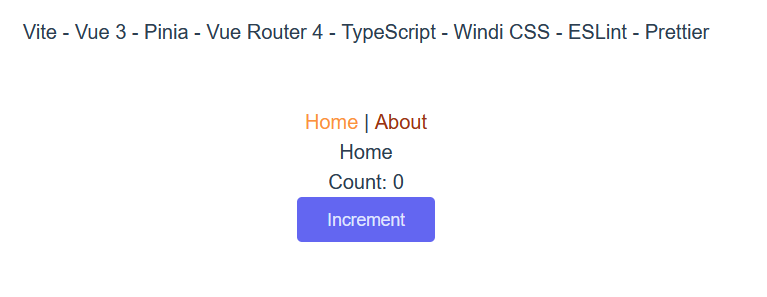

# Vite - Pinia - TypeScript - Windi Starter

Vite - Vue 3 - Pinia - Vue Router 4 - TypeScript - Windi CSS - ESLint - Prettier

This template should help get you started developing with Vue 3 and Typescript in Vite. The template uses Vue 3 `<script setup>` SFCs, check out the [script setup docs](https://v3.vuejs.org/api/sfc-script-setup.html#sfc-script-setup) to learn more.

- ⚡️ [Vue 3](https://github.com/vuejs/vue-next),

- ⚡️ [Vite 2](https://github.com/vitejs/vite), [ESBuild](https://github.com/evanw/esbuild)

- 🍍 [State Management via Pinia](https://pinia.esm.dev/)

- 🎨 [Windi CSS](https://github.com/windicss/windicss)

- 🎨 [ESLint](https://eslint.org/), [Prettier](https://prettier.io)

- 🦾 [Vue Router 4](https://router.vuejs.org/guide/)

- 🦾 [TypeScript](https://www.typescriptlang.org/)

## Installation

```bash
# clone the project
git clone https://github.com/yoruk-alper/vite-pinia-ts-windi-starter.git

# open the project directory
cd vite-pinia-ts-windi-starter

# install dependencies
npm install

# start the application
npm run dev

# make a production build
npm run build
```



## Type Support For `.vue` Imports in TS

Since TypeScript cannot handle type information for `.vue` imports, they are shimmed to be a generic Vue component type by default. In most cases this is fine if you don't really care about component prop types outside of templates. However, if you wish to get actual prop types in `.vue` imports (for example to get props validation when using manual `h(...)` calls), you can enable Volar's `.vue` type support plugin by running `Volar: Switch TS Plugin on/off` from VSCode command palette.
# startVitePiniaRouter

# startVitePiniaRouter

# startVitePiniaRouter

# helperForAfillProgram

